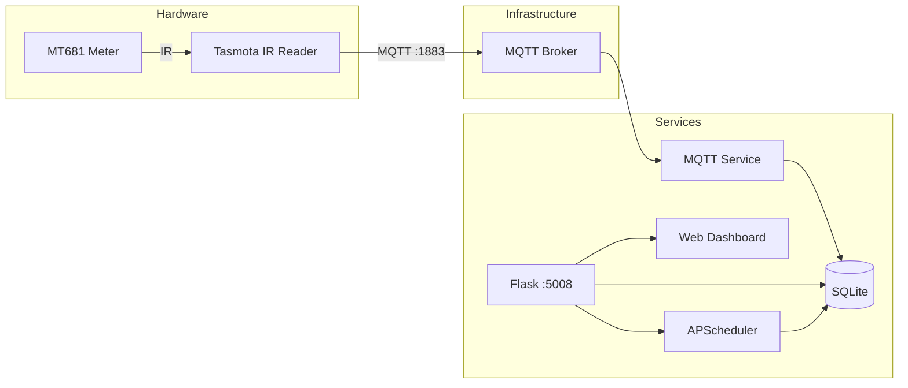

# Energy Monitor

[CI](https://github.com/momonala/energy-monitor/actions/workflows/ci.yml)
[codecov](https://codecov.io/gh/momonala/energy-monitor)

Real-time energy monitoring dashboard for MT681 smart meters via Tasmota MQTT.

## Hardware

- MT681 smart meter (or compatible SML meter)
- [Stromleser WiFi Smart Meter IR Reading Head](https://www.amazon.de/-/en/dp/B0DJP2MDLK) (Tasmota-flashed)

## Prerequisites

- Python 3.12+
- uv (Python package manager)
- MQTT broker (e.g., Mosquitto) running on the network
- Tasmota device configured to publish to `tele/tasmota/#`
- [Service Monitor](https://github.com/momonala/service-monitor) on `:5001` for Telegram alerts (optional; alert failures are logged and ignored)

## Installation

1. Clone and install dependencies:
  ```bash
   git clone https://github.com/momonala/energy-monitor.git
   cd energy-monitor
   curl -LsSf https://astral.sh/uv/install.sh | sh
   uv sync
  ```
2. Initialize the database:
  ```bash
   uv run python -m src.database
  ```
3. Configure `pyproject.toml`:
  Edit the `[tool.config]` section with your settings (MQTT, ports, `service_monitor_url`, etc.).

## Running

Two processes: the Flask app and the MQTT client.

```bash
uv run app
uv run python -m src.mqtt
```

Open `http://localhost:5008`

## Observability (Spyglass)

Logs and metrics ship to a local [Spyglass](https://github.com/momonala/spyglass) server (`spyglass_host` in `[tool.config]`, default `localhost:5013`), started separately:

```bash
cd ~/code/spyglass && uv tool install --editable . && spyglass serve
```

Query data:

```bash
curl "http://localhost:5013/metrics?project=energy-monitor&limit=20"
curl "http://localhost:5013/logs?project=energy-monitor&level=INFO"
```

## Mobile Dashboard

A simplified, mobile-optimized interface is available at `/mobile`. Mobile users (iPhone, Android) are automatically redirected; iPad users see the full desktop dashboard.

`mobile.html` overrides `_base.html`'s `header` block to nothing: with no sidebar and only one page, a title
bar carries no information, so the connection dot sits on the live card instead. The lookback select and the
chart disclosure share one bare `.mobile-controls` row (no card chrome) to keep the fold from being three
stacked boxes before any data. The chart card itself is `.js-chart-content` — `mobile.js` toggles
`is-visible` on it, so the whole card disappears when the chart is hidden.

## Project Structure

```
energy-monitor/
├── src/
│   ├── app.py          # Flask entry point, API routes, mobile detection, APScheduler (stall watch, DB health)
│   ├── database.py     # SQLAlchemy models, queries, stats
│   ├── mqtt.py         # Standalone MQTT client service entry point
│   ├── helpers.py      # Time parsing utilities
│   ├── config.py       # Configuration constants
│   ├── diagnostics.py  # Hop-ladder probe that names the fault domain behind a stall
│   └── alerts.py       # Telegram alerts via Service Monitor API
├── templates/
│   ├── _base.html      # Shared shell (sidebar, header, Spyglass layout)
│   ├── index.html      # Desktop dashboard
│   ├── compare.html    # Period comparison page
│   └── mobile.html     # Mobile dashboard
├── static/
│   ├── css/
│   │   ├── tokens.css      # Design tokens (Spyglass-aligned)
│   │   ├── base.css        # Reset, typography, shell
│   │   ├── components.css  # Buttons, cards, stats, tables
│   │   └── dashboard.css   # Page-specific layouts
│   ├── app.js          # Desktop frontend: charting, interactions, live updates
│   ├── compare.js      # Compare page frontend
│   ├── mobile.js       # Mobile frontend: simplified chart, stats, daily table
│   ├── shared.js       # Shared utilities and CSS→JS theme bridge
│   └── styles.css      # Stylesheet entry point (@imports layered CSS)
├── data/
│   └── energy.db       # SQLite database
├── tests/
│   └── test_*.py       # Test files
└── install/
    ├── install.sh                                # Raspberry Pi setup script
    ├── projects_energy-monitor.service           # systemd service for web app (includes APScheduler)
    ├── projects_energy-monitor_mqtt.service      # systemd service for MQTT client
    └── projects_energy-monitor_backup.{service,timer}  # daily DB backup
```

## Architecture


```mermaid
flowchart LR
    subgraph Hardware
        Meter[MT681 Meter] -->|IR| Tasmota[Tasmota IR Reader]
    end
    subgraph Infrastructure
        Tasmota -->|MQTT :1883| Broker[MQTT Broker]
    end
    subgraph Services
        Broker --> MQTT[MQTT Service]
        MQTT --> DB[(SQLite)]
        Flask[Flask :5008] --> DB
        Flask --> UI[Web Dashboard]
        Flask --> Scheduler[APScheduler]
        Scheduler --> DB
    end
```

**Data flow:** Meter → IR → Tasmota → MQTT Broker → MQTT Service → SQLite → Flask REST API → Browser

**Quirk — the two services share nothing but the DB.** `src/app.py` and `src/mqtt.py` run as
separate systemd units, so a module-level global set in one is always `None` in the other. Anything
Flask needs to know about ingestion must be derived from SQLite: `/status` reports
`receiving_readings` from the age of the newest row, and `handle_lwt_status` computes outage
duration the same way so it survives a restart mid-outage. Don't reintroduce a shared-client global —
it reads as working and is silently always false.

## API Endpoints


| Endpoint              | Method | Description                                              |
| --------------------- | ------ | -------------------------------------------------------- |
| `/`                   | GET    | Serve desktop dashboard (redirects mobile to `/mobile`)  |
| `/mobile`             | GET    | Serve mobile-optimized dashboard                         |
| `/compare`            | GET    | Serve period comparison page                              |
| `/api/readings`       | GET    | Fetch readings with optional time range                  |
| `/api/latest_reading` | GET    | Get most recent reading (full row)                       |
| `/api/live_power`     | GET    | Latest instantaneous power draw, for the live readout    |
| `/api/energy_summary` | GET    | Get avg daily usage, daily usage, and 30d moving average |
| `/api/stats`          | GET    | Compute statistics for a time range                      |
| `/status`             | GET    | Service health, ingestion freshness, reading counts      |
| `/observability`      | GET    | Redirects to the Spyglass-hosted observability dashboard |


### `/api/readings`

Query params:

- `start` - ISO-8601 string or ms since epoch (optional)
- `end` - ISO-8601 string or ms since epoch (optional)
- `after` - Unix timestamp; returns only records after this time (for incremental updates)

Response:

```json
[
  {"t": 1701432000000, "p": 450.5, "e": 12345.67}
]
```

- `t`: timestamp (ms since epoch)
- `p`: power (watts)
- `e`: cumulative energy (kWh)

### `/api/live_power`

No query params. Deliberately slim — it is polled every 5s by every open dashboard, so it selects only
`(timestamp, power_watts)` instead of hydrating the full row with its `raw_payload` blob. Never cached.

```json
{"t": 1701432000000, "w": 512.3, "age_s": 4.2, "stale": false}
```

- `t`: timestamp of the reading (ms since epoch)
- `w`: instantaneous power (watts)
- `age_s`: seconds since the reading landed
- `stale`: `age_s > 60` — readings normally arrive every ~10s, so a minute of silence means the feed is broken

An empty database returns `200` with `t`/`w`/`age_s` null and `stale: true`, so the client has one code path.

### `/api/energy_summary`

Query params:

- `start` - ISO-8601 string or ms since epoch (optional; limits returned `daily` and `moving_avg_30d`)
- `end` - ISO-8601 string or ms since epoch (optional; defaults to now)

When `start`/`end` are omitted, returns full default history (~52 weeks). When scoped, the server still loads up to 30 days of history internally so the moving average is accurate.

Response:

```json
{
  "avg_daily": 15.2,
  "daily": [
    {"t": 1701432000000, "kwh": 14.5, "is_partial": false},
    {"t": 1701518400000, "kwh": 15.8, "is_partial": false}
  ],
  "moving_avg_30d": [
    {"t": 1701432000000, "kwh": 14.2},
    {"t": 1701518400000, "kwh": 14.8}
  ]
}
```

- `avg_daily`: Average daily kWh over the last year
- `daily`: Daily kWh consumption for each day
- `moving_avg_30d`: 30-day moving average of daily consumption (or fewer days for dates with less history)

### `/api/stats`

Query params (required):

- `start` - ISO-8601 string or ms since epoch
- `end` - ISO-8601 string or ms since epoch

Response:

```json
{
  "start": 1701432000000,
  "end": 1701518400000,
  "stats": {
    "energy_used_kwh": 12.5,
    "min_power_watts": 120.0,
    "max_power_watts": 3500.0,
    "avg_power_watts": 450.2,
    "count": 8640
  }
}
```

## Data Model

```
EnergyReading
├── timestamp: DateTime (PK, indexed)
├── meter_id: String
├── power_watts: Float
├── energy_in_kwh: Float
├── energy_out_kwh: Float
├── power_phase_1_watts: Float
├── power_phase_2_watts: Float
├── power_phase_3_watts: Float
└── raw_payload: Text (JSON)
```

## Key Concepts


| Concept          | Description                                             |
| ---------------- | ------------------------------------------------------- |
| `energy_in_kwh`  | Cumulative energy consumed from grid (meter reading)    |
| `energy_out_kwh` | Cumulative energy exported to grid (for solar)          |
| `power_watts`    | Instantaneous power draw                                |
| `MT681`          | Smart meter model; payload key in Tasmota MQTT messages |
| `E_in` / `E_out` | Tasmota payload fields for energy in/out                |


## Storage


| Path                            | Purpose                                             |
| ------------------------------- | --------------------------------------------------- |
| `data/energy.db`                | SQLite database with all readings                   |
| `data/backups/energy-YYYYMMDD.db` | Daily WAL-safe backup (03:00, last 7 kept)        |

Backups run via the `projects_energy-monitor_backup.timer` systemd timer, which calls
`scripts/backup_db.sh` (`sqlite3 .backup` — safe against a live WAL database, unlike `cp`).


## Background Jobs

The Flask app runs periodic tasks in-process via `flask-apscheduler`:


| Schedule       | Task                                                                        |
| -------------- | --------------------------------------------------------------------------- |
| Every minute   | `check_ingestion_stall` — detect, diagnose, and escalate ingestion outages   |
| Hourly `:00`   | `log_db_health_check` — reading counts and DB size metrics (no alerts)       |


### Alerts

Sent as Markdown via Service Monitor `POST /api/alert` (`service_monitor_url` in `[tool.config]`, default `http://localhost:5001`). Failures are logged and never crash the app.


| Trigger | Message |
| ------- | ------- |
| `check_ingestion_stall` (every minute) | `No readings for 15m` plus a verdict naming the fault domain |
| Tasmota LWT `Online` | All-clear, with downtime measured from the last stored reading |

**`check_ingestion_stall` is the only source of outage alerts.** LWT `Offline` deliberately
stays silent, and the hourly health check is metrics-only. The two run in different
processes and cannot coordinate, so a single owner is the only way to guarantee one outage
never produces two alerts — and the owner is the one that can diagnose rather than just
report the symptom.

It runs every minute but alerts only when the outage *crosses* a threshold — 2m, 15m, 1h,
6h, 24h, then daily — so each fires exactly once and the network probe runs only on a
crossing, never on every tick. Crossings rather than bands means no memory of what was
already sent, so a restart mid-outage cannot reset the cadence. The 2-minute floor is the
blip filter: readings arrive every ~10s, so 2 minutes of silence is a real fault while a
brief WiFi drop resolves before it trips. The Aug 2026 outage sent 138 identical hourly
messages; the same outage now sends 5 in the first day, each one diagnosed.

#### Diagnosing a stall (`src/diagnostics.py`)

An empty database looks the same whether the meter dropped off WiFi or this host lost its
path to the LAN, so the alert probes a ladder of hops and names which one broke:

| gateway | access point | meter | Verdict |
| ------- | ------------ | ----- | ------- |
| ❌ | — | — | this host's own link is down |
| ✅ | ❌ | ❌ | LAN path fault — switch isolation, cabling, routing |
| ✅ | ✅ | ❌ | meter offline — power or WiFi range |
| ✅ | ✅ | ✅ | broker or ingestion service, not the network |

**The access point is the discriminator.** A meter that fell off WiFi leaves it reachable;
a segmented LAN does not. Probing only the meter cannot separate those two cases and
reports the wrong one — which is exactly how a switch-isolation fault was misread as a
device outage for seven days. When the meter does answer, its `Status 11` counters
(`LinkCount`, `Downtime`, `Uptime`) further separate a flapping radio from a clean crash.

Probe targets are `gateway_ip` and `access_point_ip` in `[tool.config]`.
